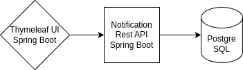

# Notification Management Service
## Project set-up:
The project can be launched both separately and together.

* To run together: you need to run the docker-compose file. it will set up postgreSQL, back-end service and ui-service containers itself.\
    ```docker compose up``` 
* To run separately: you need to  set up PostgreSQL and run  both services. use this to run Spring Boot projects\
    ```mvn spring-boot:run```

If you use Docker to run these are default settings for ports:
* PostgreSQL - :54321
* backend - :8080
* ui service - :8000

<b>Initial ADMIN credintials</b>: \
``username : admin``\
``password : admin``
## Architecture
Main stack: Java 17, SpringBoot3, PostgreSQL, Thymeleaf



I separated the back-end side and front-end side into two different services because it allows for easier maintenance and scalability. Security is implemented using JWT tokens.
I wanted to use a third-party user data handler like KeyCloak or create my own service for this, but my PC toaster (pc)* said no :D.
I implemented main back end service api in ui but there are still some missing parts.  

