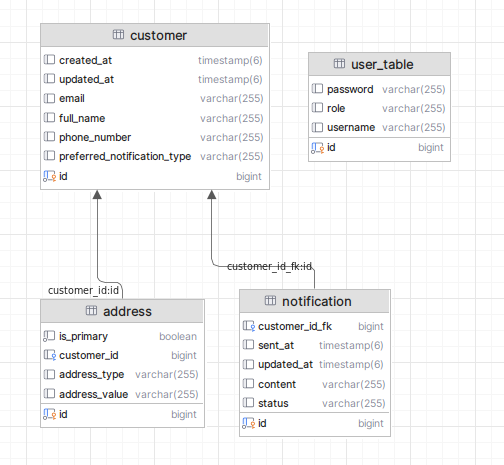

# Notification Managment REST API

microservice to centralize and manage customer contact information and preferences
for notifications.

for better documentation run project and use swagger open-api.

## Run
``mvn spring-boot:run``\

## Initial admin credintials
``username : admin``\
``password : admin``

## Architecture
